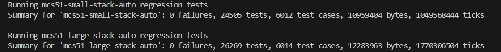

[中文](./README_zh.md)

# Summary

This is the [sdcc](https://sdcc.sourceforge.net/) + [binutils](https://www.gnu.org/software/binutils/) compiler suite prepared for mcs51. 

It uses sdcc as the front end to generate assembly and then uses gnu as+ld to complete the compilation and linking.

The source code of this repository is referenced from: https://github.com/volumit/sdcc_aurix_scr_42 

**What's the difference ?**

The linker of sdcc does not support the dead code elimination function (i.e., deleting unused functions in the program), so when compiling a large number of c files with sdcc, the generated hex will be very large in size.

This solution can solve this problem. 

binutils as supports syntax like `.section.text._func`, so a section can be generated for each function. Thus, the ld can use the `--gc-sections` feature to remove unused sections.

This toolchain is in the experimental stage, it has already passed the test suite.



# Notice

Some functions may be somewhat different from sdcc.

  - **Not support overlay**：All local variables are saved to the stack, so the `--stack-auto --nooverlay` parameter must be enabled,otherwise, the compilation will fail.
  - **Not support medium, huge model**：Only the 'small' and 'large' models are supported
  - **Not support address > 64K**：References to addresses greater than '0xFFFF' are not supported, and thus SFR32 is not supported either
  - **Not support xstack**: The stack can only be located in 'iram'
  - **Absolute address position**：'__at(xxx)' cannot be used for absolute address localization of 'data idata xdata code', ** except for the SFR register **, because ld uses linker script for address allocation. To use this function, refer to the "Usage" section below, or directly define the absolute position of the symbol using '-Wl,--defsym='
  - **Stack**：Since the overlay feature is not supported, all local variables and function parameters are stored in the stack. This poses a challenge for mcs51 because even with the large model, the maximum remaining size of the stack is' 256-32 = 224 bytes'. Therefore, for function calls, Don't use too many function parameters and nested calls, as this will accelerate stack overflow.

# Build It

Run `apt install build-essential` to install gcc at first.

Then, run:

```shell
git clone https://github.com/github0null/sdcc-binutils-mcs51.git
cd sdcc-binutils-mcs51
git submodule update --init --recursive
cd build
./do_all
```

After compilation is completed, the generated binary is located in: `build/_install`

## Build It For win32

Please install `x86_64-w64-mingw32-gcc` and `libz-mingw-w64-dev` first.

cd to build-win32 and run:

```shell
./binutils_configure
./binutils_make
./sdcc_configure
./sdcc_make
```

# Usage

Please refer to the Makefile in the `examples` directory

```makefile
main.hex: main.o delay.o foo.o
  @echo "link $@"
  $(CC) -mmcs51 --model-small --stack-auto --nooverlay --out-fmt-ihx -Wl,--print-memory-usage -o $@ $^

%.o: %.c | Makefile
  @echo "CC $<"
  @$(CC) -c -mmcs51 --model-small --stack-auto --nooverlay -o $@ $<
```

## Absolute address reference

If you want to use an absolute address reference for 'data idata xdata code', please implement it by referring to the following snippet:

```c
extern __xdata unsigned char REG_1_RES; // 0xCA00
extern __xdata unsigned char REG_2;	// 0xCA01
void dummy()
{
  __asm
    .globl _REG_1_RES, _REG_2
    .section .xdata, "aw"
    .equ _REG_1_RES, 0xCA00
    .equ _REG_2, 0xCA01
  __endasm;
}
```

Another more convenient method is to directly pass the compilation parameters `-Wl,--defsym=_REG_1_RES=0xCA00 -Wl,--defsym=_REG_2=0xCA01` to directly define the absolute position of the symbol.

And then define a declaration in you code:

```c
extern __xdata unsigned char REG_1_RES;
extern __xdata unsigned char REG_2;
```

> Note: SDCC will add a '_' prefix for the symbol
